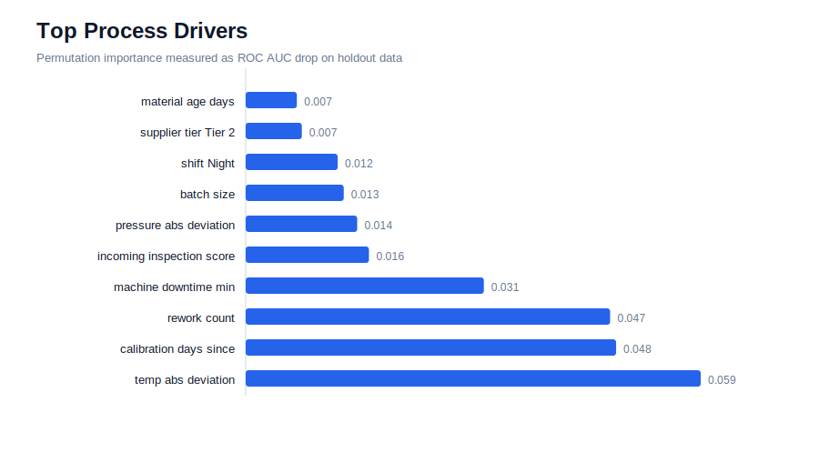
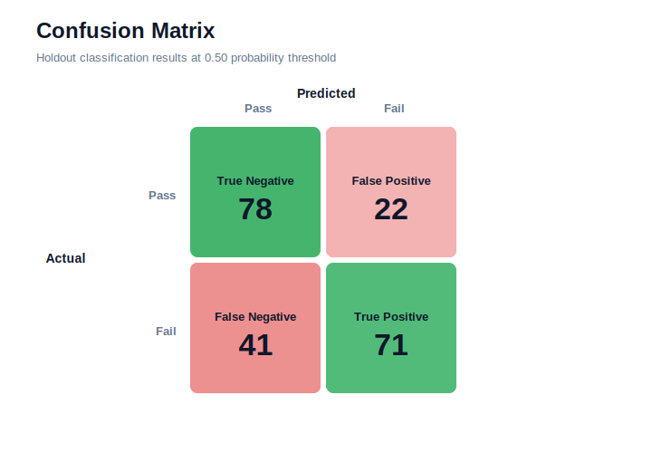
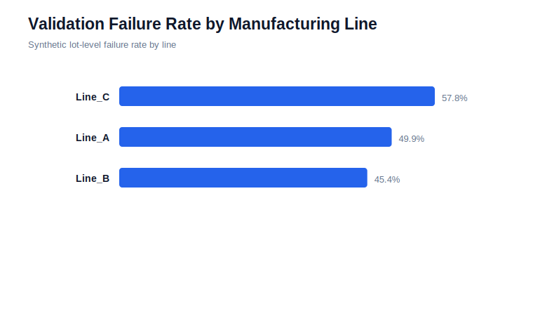
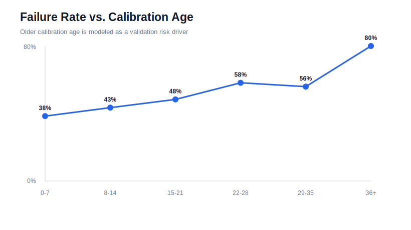

# Manufacturing Data Validation ML

Machine learning workflow for identifying process inputs associated with manufacturing validation failures.

This repository uses a synthetic manufacturing dataset to demonstrate the same type of applied analytics workflow used in production environments: data validation, feature engineering, classification modeling, model evaluation, and driver interpretation. The data is synthetic so the project can be shared publicly without exposing proprietary build, test, or quality records.

## Business Problem

Manufacturing and validation teams often need to understand why certain builds fail downstream tests. The goal of this project is to identify which process conditions are most associated with validation failure risk so engineers can focus root-cause investigation on the highest-signal inputs.

Example target:

> Predict whether a production lot is likely to fail validation based on upstream process, equipment, and test characteristics.

## What This Project Shows

- Clean and validate a manufacturing-style dataset
- Engineer process features from raw operational inputs
- Train a binary classification model
- Evaluate model quality with accuracy, precision, recall, F1, ROC AUC, and confusion matrix
- Estimate feature importance through permutation analysis
- Translate model output into process-improvement recommendations

## Repository Structure

```text
.
|-- data/
|   |-- synthetic_manufacturing_validation.csv
|-- reports/
|   |-- figures/
|   |-- feature_importance.csv
|   |-- model_metrics.json
|   |-- model_summary.md
|-- src/
|   |-- generate_charts.py
|   |-- generate_synthetic_data.py
|   |-- train_model.py
|-- requirements.txt
|-- README.md
```

## Methods

The pipeline uses a logistic classifier implemented with NumPy so the project remains lightweight and easy to run. The modeling workflow mirrors a standard analytics approach:

1. Generate or load lot-level manufacturing records
2. Validate expected columns and missing values
3. Encode categorical process fields
4. Standardize numeric features
5. Train a binary classifier
6. Evaluate holdout performance
7. Use permutation importance to rank process drivers

## Key Inputs

Synthetic features include:

- `line_id`
- `shift`
- `operator_experience_months`
- `batch_size`
- `ambient_humidity_pct`
- `machine_downtime_min`
- `calibration_days_since`
- `material_age_days`
- `incoming_inspection_score`
- `process_temperature_c`
- `process_pressure_psi`
- `rework_count`
- `validation_fail`

## Current Results

Run results are saved in `reports/`.

Current holdout performance:

- Accuracy: 0.703
- Precision: 0.763
- Recall: 0.634
- F1: 0.693
- ROC AUC: 0.760

Top modeled drivers include process temperature deviation, calibration age, rework count, machine downtime, incoming inspection score, pressure deviation, batch size, and night shift. These are realistic examples of variables that can support targeted engineering review, not proof of a real production process.

## Visual Summary

### Process Driver Importance



### Holdout Confusion Matrix



### Manufacturing Line Failure Rate



### Calibration Age Risk Trend



## Run Locally

```bash
pip install -r requirements.txt
python src/generate_synthetic_data.py
python src/train_model.py
python src/generate_charts.py
```

## Why This Matters

This project represents the kind of work that connects data science to operational decisions:

- Which process inputs are most associated with failure?
- Where should engineers focus root-cause analysis?
- Which upstream signals could be monitored before downstream validation?
- How can model outputs be translated into actions for manufacturing teams?

## Skills Demonstrated

Python, SQL-style data thinking, pandas, NumPy, classification modeling, feature engineering, model evaluation, permutation importance, manufacturing analytics, root-cause analysis, and stakeholder-oriented reporting.
